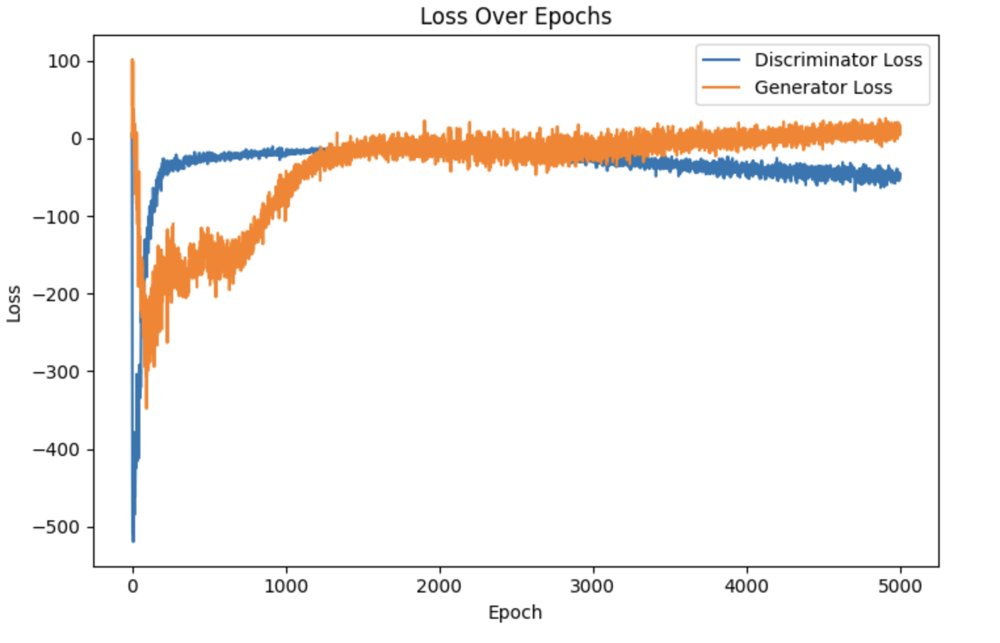

# 128x128

## Models

### Generator
| Layer (type)                         | Output Shape       | Param #     |
|------------------------------------|--------------------|-------------|
| dense_2 (Dense)                    | (None, 32768)      | 3,309,568   |
| reshape_1 (Reshape)                | (None, 8, 8, 512)  | 0           |
| batch_normalization_3 (BatchNormalization) | (None, 8, 8, 512) | 2,048       |
| leaky_re_lu_6 (LeakyReLU)          | (None, 8, 8, 512)  | 0           |
| conv2d_transpose_3 (Conv2DTranspose)| (None, 16, 16, 256)| 2,097,408   |
| batch_normalization_4 (BatchNormalization) | (None, 16, 16, 256)| 1,024       |
| leaky_re_lu_7 (LeakyReLU)          | (None, 16, 16, 256)| 0           |
| conv2d_transpose_4 (Conv2DTranspose)| (None, 32, 32, 128)| 524,416     |
| batch_normalization_5 (BatchNormalization) | (None, 32, 32, 128)| 512         |
| leaky_re_lu_8 (LeakyReLU)          | (None, 32, 32, 128)| 0           |
| conv2d_transpose_5 (Conv2DTranspose)| (None, 64, 64, 64) | 131,136     |
| batch_normalization_6 (BatchNormalization) | (None, 64, 64, 64) | 256         |
| leaky_re_lu_9 (LeakyReLU)          | (None, 64, 64, 64) | 0           |
| conv2d_transpose_6 (Conv2DTranspose)| (None, 128, 128, 3)| 3,075       |

**Total params**: 6,069,443 (23.15 MB)  
**Trainable params**: 6,067,523 (23.15 MB)  
**Non-trainable params**: 1,920 (7.50 KB)

### Discriminator
| Layer (type)            | Output Shape       | Param #    |
|-------------------------|--------------------|------------|
| conv2d_3 (Conv2D)       | (None, 64, 64, 64) | 3,136      |
| leaky_re_lu_10 (LeakyReLU) | (None, 64, 64, 64) | 0        |
| conv2d_4 (Conv2D)       | (None, 32, 32, 128)| 131,200    |
| leaky_re_lu_11 (LeakyReLU) | (None, 32, 32, 128)| 0        |
| conv2d_5 (Conv2D)       | (None, 16, 16, 256)| 524,544    |
| leaky_re_lu_12 (LeakyReLU) | (None, 16, 16, 256)| 0        |
| conv2d_6 (Conv2D)       | (None, 8, 8, 512)  | 2,097,664  |
| leaky_re_lu_13 (LeakyReLU) | (None, 8, 8, 512) | 0         |
| conv2d_7 (Conv2D)       | (None, 4, 4, 1)    | 8,193      |
| flatten_1 (Flatten)     | (None, 16)         | 0          |
| dense_3 (Dense)         | (None, 1)          | 17         |

**Total params**: 2,764,754 (10.55 MB)  
**Trainable params**: 2,764,754 (10.55 MB)  
**Non-trainable params**: 0 (0.00 B)

## Loss
