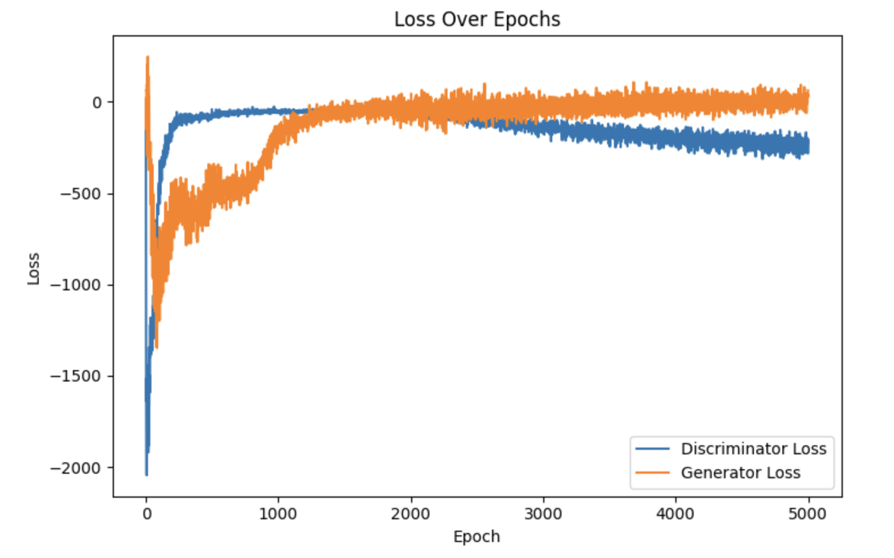

# 256x256

## Model

### Generator
| Layer (type)                    | Output Shape         | Param #     |
|---------------------------------|----------------------|-------------|
| dense (Dense)                   | (None, 32768)        | 3,309,568   |
| reshape (Reshape)               | (None, 8, 8, 512)     | 0           |
| batch_normalization (BatchNormalization) | (None, 8, 8, 512) | 2,048       |
| leaky_re_lu (LeakyReLU)         | (None, 8, 8, 512)     | 0           |
| conv2d_transpose (Conv2DTranspose)   | (None, 16, 16, 256)    | 2,097,408   |
| batch_normalization_1 (BatchNormalization) | (None, 16, 16, 256) | 1,024       |
| leaky_re_lu_1 (LeakyReLU)       | (None, 16, 16, 256)   | 0           |
| conv2d_transpose_1 (Conv2DTranspose) | (None, 32, 32, 128)    | 524,416     |
| batch_normalization_2 (BatchNormalization) | (None, 32, 32, 128) | 512         |
| leaky_re_lu_2 (LeakyReLU)       | (None, 32, 32, 128)   | 0           |
| conv2d_transpose_2 (Conv2DTranspose) | (None, 64, 64, 64)     | 131,136     |
| batch_normalization_3 (BatchNormalization) | (None, 64, 64, 64)  | 256         |
| leaky_re_lu_3 (LeakyReLU)       | (None, 64, 64, 64)    | 0           |
| conv2d_transpose_3 (Conv2DTranspose) | (None, 128, 128, 32)   | 32,800      |
| batch_normalization_4 (BatchNormalization) | (None, 128, 128, 32)| 128         |
| leaky_re_lu_4 (LeakyReLU)       | (None, 128, 128, 32)  | 0           |
| conv2d_transpose_4 (Conv2DTranspose) | (None, 256, 256, 3)    | 1,539       |

**Total params**: 6,100,835 (23.27 MB)  
**Trainable params**: 6,098,851 (23.27 MB)  
**Non-trainable params**: 1,984 (7.75 KB)

### Discriminator
| Layer (type)             | Output Shape         | Param #     |
|--------------------------|----------------------|-------------|
| conv2d (Conv2D)          | (None, 128, 128, 64) | 3,136       |
| leaky_re_lu_5 (LeakyReLU)| (None, 128, 128, 64) | 0           |
| conv2d_1 (Conv2D)        | (None, 64, 64, 128)  | 131,200     |
| leaky_re_lu_6 (LeakyReLU)| (None, 64, 64, 128)  | 0           |
| conv2d_2 (Conv2D)        | (None, 32, 32, 256)  | 524,544     |
| leaky_re_lu_7 (LeakyReLU)| (None, 32, 32, 256)  | 0           |
| conv2d_3 (Conv2D)        | (None, 16, 16, 512)  | 2,097,664   |
| leaky_re_lu_8 (LeakyReLU)| (None, 16, 16, 512)  | 0           |
| conv2d_4 (Conv2D)        | (None, 8, 8, 512)    | 4,194,816   |
| leaky_re_lu_9 (LeakyReLU)| (None, 8, 8, 512)    | 0           |
| conv2d_5 (Conv2D)        | (None, 4, 4, 512)    | 4,194,816   |
| leaky_re_lu_10 (LeakyReLU)| (None, 4, 4, 512)   | 0           |
| conv2d_6 (Conv2D)        | (None, 2, 2, 512)    | 4,194,816   |
| leaky_re_lu_11 (LeakyReLU)| (None, 2, 2, 512)   | 0           |
| conv2d_7 (Conv2D)        | (None, 1, 1, 512)    | 4,194,816   |
| leaky_re_lu_12 (LeakyReLU)| (None, 1, 1, 512)   | 0           |
| flatten (Flatten)        | (None, 512)          | 0           |
| dense_1 (Dense)          | (None, 1)            | 513         |

**Total params**: 19,536,321 (74.53 MB)  
**Trainable params**: 19,536,321 (74.53 MB)  
**Non-trainable params**: 0 (0.00 B)

## Loss
