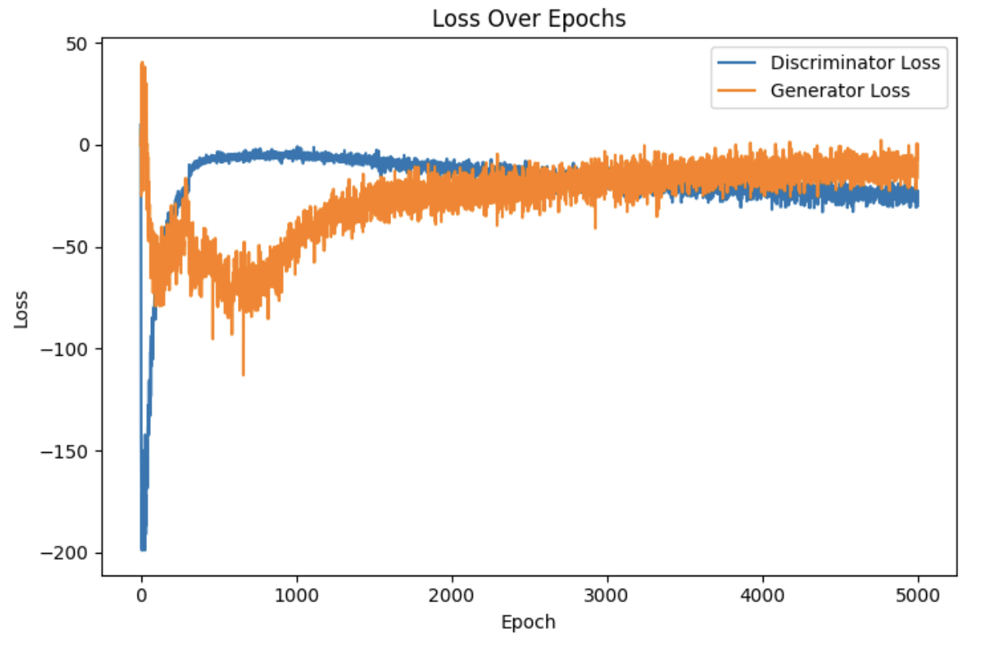

# 64x64

## Models

### Generator
| Layer (type)                         | Output Shape      | Param #     |
|-------------------------------------|-------------------|-------------|
| dense_2 (Dense)                     | (None, 16384)     | 1,654,784   |
| reshape_1 (Reshape)                 | (None, 8, 8, 256) | 0           |
| batch_normalization_3              | (None, 8, 8, 256) | 1,024       |
| (BatchNormalization)               |                   |             |
| leaky_re_lu_6 (LeakyReLU)          | (None, 8, 8, 256) | 0           |
| conv2d_transpose_3 (Conv2DTranspose)| (None, 16, 16, 128)| 524,416    |
| batch_normalization_4              | (None, 16, 16, 128)| 512         |
| (BatchNormalization)               |                   |             |
| leaky_re_lu_7 (LeakyReLU)          | (None, 16, 16, 128)| 0          |
| conv2d_transpose_4 (Conv2DTranspose)| (None, 32, 32, 64)| 131,136     |
| batch_normalization_5              | (None, 32, 32, 64)| 256         |
| (BatchNormalization)               |                   |             |
| leaky_re_lu_8 (LeakyReLU)          | (None, 32, 32, 64)| 0           |
| conv2d_transpose_5 (Conv2DTranspose)| (None, 64, 64, 3) | 3,075       |

**Total params**: 2,315,203 (8.83 MB)  
**Trainable params**: 2,314,307 (8.83 MB)  
**Non-trainable params**: 896 (3.50 KB)

### Discriminator
| Layer (type)            | Output Shape       | Param #   |
|-------------------------|--------------------|-----------|
| conv2d_3 (Conv2D)       | (None, 32, 32, 64) | 3,136     |
| leaky_re_lu_9 (LeakyReLU)| (None, 32, 32, 64) | 0         |
| conv2d_4 (Conv2D)       | (None, 16, 16, 128)| 131,200   |
| leaky_re_lu_10 (LeakyReLU)| (None, 16, 16, 128)| 0        |
| conv2d_5 (Conv2D)       | (None, 8, 8, 256)  | 524,544   |
| leaky_re_lu_11 (LeakyReLU)| (None, 8, 8, 256) | 0         |
| flatten_1 (Flatten)     | (None, 16384)      | 0         |
| dense_3 (Dense)         | (None, 1)          | 16,385    |

**Total params**: 675,265 (2.58 MB)  
**Trainable params**: 675,265 (2.58 MB)  
**Non-trainable params**: 0 (0.00 B)

## Loss
